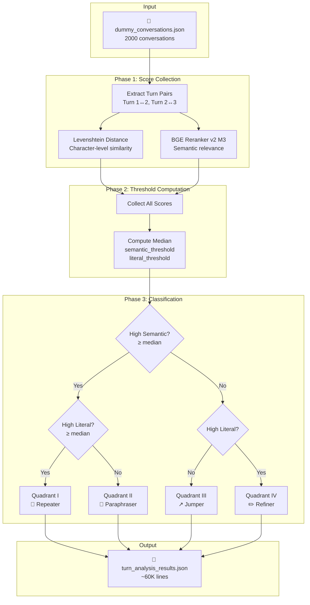
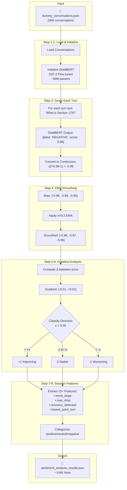

# Multi-Turn Dialogue and Sentiment Gradient Analysis

## Project Overview

This project focuses on simulating and analyzing multi-turn conversations for a chatbot study in the **tax and accounting research** domain. The goal is to generate realistic conversations between CPAs and a Q&A chatbot, then analyze user behavior patterns and sentiment progression across conversation turns.

---

## Tasks Completed

### Task 1: Generate Dummy Data ✅

**Script:** `generate_conversations.py`

**Purpose:** Generate 2000 realistic multi-turn tax/accounting Q&A chatbot conversations.

**Key Features:**
- Uses OpenRouter API with model `xiaomi/mimo-v2-flash:free` (configurable via `.env`)
- Batch generation (15 conversations per API call)
- Incremental saving to prevent data loss
- Resume capability from existing data

**Configuration (`.env`):**
```
OPENROUTER_API_KEY=your_key_here
OPENROUTER_MODEL=xiaomi/mimo-v2-flash:free
NUM_CONVERSATIONS=2000
```

#### LLM Prompt Used

```
Generate {batch_size} realistic tax and accounting research Q&A chatbot conversations.

CRITICAL - CONVERSATION FLOW PATTERNS (distribute evenly across batch):
Generate approximately 4 conversations of EACH type per batch:

1. REPEATER PATTERN (~25%): User restates almost the same question because bot didn't answer well
   - Turn 2 is nearly identical to Turn 1, just slightly reworded
   - Example: Turn 1: "What's the Section 179 limit for 2024?" → Turn 2: "I asked about the Section 179 deduction limits for this year"
   - Shows user frustration that bot didn't understand

2. PARAPHRASER PATTERN (~25%): Same intent expressed completely differently
   - Turn 2 asks the same thing but with totally different words/structure
   - Example: Turn 1: "What's the Section 179 limit?" → Turn 2: "How much equipment can I write off immediately under the first-year deduction rules?"
   - User trying different approach to get answer

3. JUMPER PATTERN (~25%): Complete topic change, unrelated questions
   - Turn 2 is about a completely different tax/accounting topic
   - Example: Turn 1: "What's the Section 179 limit?" → Turn 2: "By the way, what are the rules for deducting home office expenses?"
   - User switching to new question entirely

4. DEEP DIVER PATTERN (~25%): Natural continuation with similar vocabulary
   - Turn 2 builds on Turn 1 using similar terms, going deeper into the topic
   - Example: Turn 1: "What's the Section 179 limit?" → Turn 2: "Does that Section 179 limit apply to used equipment, or only new purchases?"
   - Natural follow-up that references the same concepts

Requirements for EACH conversation:
- Each conversation should have 2-20 user messages (vary the count)
- FIRST user message: Direct question about a tax or accounting topic
- DO NOT include self-identification like "I'm a CPA" - just ask directly
- Apply the conversation flow pattern consistently throughout each conversation

QUESTION TYPES (mix across conversations):
- DIRECT: "What is the standard mileage rate for 2024?"
- HYPOTHETICAL: "If a client sells rental property at a loss after taking depreciation..."
- FACT: "What are the IRS wash sale rules?"
- DOCUMENT_GENERATION: "Help me draft a memo about S-Corp election"
- KEYWORD: "Section 179 limits" (short queries)
- KEYWORD_PLUS: "Section 179 for used equipment S-corp"
- ADVISORY: "Best approach to minimize capital gains?"

FRUSTRATION SOURCES (for Repeater patterns especially):
- Bot gave incorrect/outdated information
- Bot's answer was too vague or didn't address the specific question
- Bot asked for information already provided
- Bot gave contradictory answers

Topics: tax deductions, depreciation, capital gains, self-employment tax, estimated taxes, GAAP, revenue recognition, payroll taxes, 401k/IRA, home office, vehicle expenses, cryptocurrency, rental income, etc.

IMPORTANT: Each user message should be at least 15 words with specific details.
```

**Output Format:**
```json
[
  {
    "conversation_id": "uuid",
    "turns": [
      {"turn": 1, "speaker": "user", "text": "..."},
      {"turn": 2, "speaker": "user", "text": "..."},
      ...
    ]
  }
]
```

**Output File:** `dummy_conversations.json`

---

## Task 2: Turn-by-Turn Behavior Analysis ✅

**Script:** `turn_analyzer.py`

**Purpose:** Analyze the relationship between consecutive turns (Turn 1 vs 2, Turn 2 vs 3, etc.) to classify user behavior patterns based on text similarity and semantic relevance.

### Pipeline Flow Diagram



---

### Step-by-Step Process

#### Step 1: Load Input Data

```python
with open("dummy_conversations.json", "r", encoding="utf-8") as f:
    conversations = json.load(f)
```

**Input:** `dummy_conversations.json` - Array of 2000 conversations, each containing:
- `conversation_id`: UUID string
- `turns`: Array of user messages with `turn`, `speaker`, and `text` fields

---

#### Step 2: Initialize Models

**Model 1: Levenshtein Distance (python-Levenshtein library)**

- **Purpose:** Measures **literal/surface text similarity** between two strings
- **Type:** Character-level edit distance (insertions, deletions, substitutions)
- **Output Range:** 0.0 (completely different) to 1.0 (identical)
- **Formula:** 
  ```
  similarity = 1 - (levenshtein_distance(text1, text2) / max(len(text1), len(text2)))
  ```
- **Example:**
  - "What is Section 179?" vs "What's the Section 179 limit?" → ~0.65 (high literal)
  - "Section 179 rules" vs "Home office deduction" → ~0.15 (low literal)

**Model 2: BGE Reranker v2 M3 (BAAI/bge-reranker-v2-m3)**

- **Purpose:** Measures **semantic relevance/similarity** between two texts
- **Type:** Cross-encoder neural network (processes both texts jointly)
- **Parameters:** ~568M parameters
- **Architecture:** XLM-RoBERTa backbone fine-tuned for reranking
- **Device:** CUDA GPU (falls back to CPU if unavailable)
- **Output:** Raw logit score (can be negative, zero, or positive)
  - **Positive scores** = semantically related/similar meaning
  - **Negative scores** = semantically unrelated/different topics
  - **Zero** = neutral/borderline

```python
from sentence_transformers import CrossEncoder

self.reranker = CrossEncoder("BAAI/bge-reranker-v2-m3", device="cuda")
```

---

#### Step 3: Analyze Turn Pairs (Phase 1 - Score Collection)

For each conversation, extract consecutive turn pairs and compute both similarity scores:

```python
for conv in conversations:
    turns = conv.get("turns", [])
    
    # Analyze Turn 1 vs Turn 2
    if len(turns) >= 2:
        pair_1_2 = {
            "levenshtein_similarity": compute_levenshtein_similarity(turns[0]["text"], turns[1]["text"]),
            "reranker_score_raw": reranker.predict([(turns[0]["text"], turns[1]["text"])])[0]
        }
    
    # Analyze Turn 2 vs Turn 3
    if len(turns) >= 3:
        pair_2_3 = {
            "levenshtein_similarity": compute_levenshtein_similarity(turns[1]["text"], turns[2]["text"]),
            "reranker_score_raw": reranker.predict([(turns[1]["text"], turns[2]["text"])])[0]
        }
```

**Output per pair:**
| Metric | Description | Range |
|--------|-------------|-------|
| `levenshtein_similarity` | Character-level text overlap | 0.0 - 1.0 |
| `reranker_score_raw` | Semantic relevance (raw logit) | -∞ to +∞ (typically -3 to +3) |

---

#### Step 4: Compute Median Thresholds (Phase 2)

Instead of using fixed thresholds, we compute **median values** from the actual data distribution:

```python
all_semantic = [pair["reranker_score_raw"] for all pairs]
all_literal = [pair["levenshtein_similarity"] for all pairs]

semantic_threshold = np.median(all_semantic)  # e.g., 0.0863
literal_threshold = np.median(all_literal)    # e.g., 0.2775
```

**Why Median-Based Thresholds?**
- Ensures approximately 50% of data falls above/below each threshold
- Naturally balances quadrant distribution (~25% each)
- Adapts to the actual score distribution of the dataset
- Avoids issues with fixed thresholds (e.g., 0.5) that could cause 99%+ in one quadrant

---

#### Step 5: Classify into Quadrants (Phase 3)

Using the computed thresholds, classify each turn pair into one of four behavior quadrants:

```python
def classify_quadrant(semantic_score, literal_score, semantic_threshold, literal_threshold):
    high_semantic = semantic_score >= semantic_threshold
    high_literal = literal_score >= literal_threshold
    
    if high_semantic and high_literal:
        return ("I", "Repeater")
    elif high_semantic and not high_literal:
        return ("II", "Paraphraser")
    elif not high_semantic and not high_literal:
        return ("III", "Jumper")
    else:  # not high_semantic and high_literal
        return ("IV", "Refiner")
```

**User Behavior Matrix (4 Quadrants):**

|  | **High Literal** (≥ median) | **Low Literal** (< median) |
|---|---|---|
| **High Semantic** (≥ median) | **I: Repeater** | **II: Paraphraser** |
| **Low Semantic** (< median) | **IV: Refiner** | **III: Jumper** |

**Quadrant Interpretations:**

| Quadrant | Behavior | Description | User Intent |
|----------|----------|-------------|-------------|
| **I - Repeater** | Same words, same meaning | User restates nearly identical question | Bot didn't answer properly |
| **II - Paraphraser** | Different words, same meaning | User rephrases to try again | Bot didn't understand |
| **III - Jumper** | Different words, different topic | User switches to new subject | Moving on / giving up |
| **IV - Refiner** | Same words, different meaning | User modifies/corrects wording | Clarifying or negating |

---

#### Step 6: Generate Output

**Output File:** `turn_analysis_results.json`

**Sample Output:**
```json
{
  "conversation_id": "29ae5544-c8f2-4b6b-844a-ccdeed12a8d6",
  "num_turns": 3,
  "turn_analyses": [
    {
      "levenshtein_similarity": 0.338,
      "reranker_score_raw": 1.0,
      "pair": [1, 2],
      "turn_1_text": "I purchased a $30,000 SUV for my landscaping business in 2024...",
      "turn_2_text": "I just asked about the Section 179 deduction for my $30,000 SUV...",
      "quadrant": "I",
      "behavior_label": "Repeater"
    },
    {
      "levenshtein_similarity": 0.2573,
      "reranker_score_raw": 0.7158,
      "pair": [2, 3],
      "turn_2_text": "I just asked about the Section 179 deduction for my $30,000 SUV...",
      "turn_3_text": "Your previous answer was completely unhelpful and didn't address the SUV weight requirement...",
      "quadrant": "II",
      "behavior_label": "Paraphraser"
    }
  ]
}
```

---

#### Step 7: Print Summary Statistics

```
============================================================
ANALYSIS SUMMARY
============================================================

Total conversations analyzed: 2000
Total turn pairs analyzed: 3998

----------------------------------------
THRESHOLDS USED (median-based):
----------------------------------------
Semantic (reranker_raw): 0.0863
Literal (levenshtein):   0.2775

----------------------------------------
RERANKER SCORE (RAW) DISTRIBUTION:
----------------------------------------
Min:    -0.0023
Max:    1.0000
Mean:   0.3245
Median: 0.0863
Std:    0.3912

----------------------------------------
LEVENSHTEIN SIMILARITY DISTRIBUTION:
----------------------------------------
Min:    0.0498
Max:    0.6521
Mean:   0.2831
Median: 0.2775
Std:    0.0784

----------------------------------------
BEHAVIOR DISTRIBUTION:
----------------------------------------
Quadrant I  (Repeater):    1278 ( 32.0%)
Quadrant II (Paraphraser):  721 ( 18.0%)
Quadrant III (Jumper):     1273 ( 31.8%)
Quadrant IV (Refiner):      726 ( 18.2%)
```

---

## Task 3: Sentiment Gradient Analysis ✅

**Script:** `sentiment_analyzer.py`

**Purpose:** Analyze sentiment progression across all turns in each conversation to detect frustration patterns, satisfaction trends, and emotional recovery patterns.

### Pipeline Flow Diagram



---

### Step-by-Step Process

#### Step 1: Load Input Data

```python
with open("dummy_conversations.json", "r", encoding="utf-8") as f:
    conversations = json.load(f)
```

Same input as Task 2: `dummy_conversations.json`

---

#### Step 2: Initialize Sentiment Model

**Model: DistilBERT Fine-tuned on SST-2**

```python
from transformers import pipeline

self.sentiment_analyzer = pipeline(
    "sentiment-analysis",
    model="distilbert-base-uncased-finetuned-sst-2-english",
    device=0  # GPU
)
```

##### Why DistilBERT for This Task?

| Consideration | DistilBERT | BERT-base | RoBERTa | GPT-based |
|--------------|------------|-----------|---------|-----------|
| **Parameters** | 66M ✅ | 110M | 125M | 175M+ |
| **Speed** | ~2x faster than BERT ✅ | Baseline | Similar | Much slower |
| **Accuracy on SST-2** | 91.3% ✅ | 93.5% | 94.8% | ~95% |
| **Memory** | Low ✅ | Medium | Medium | High |
| **Pre-trained on sentiment** | Yes (SST-2) ✅ | Needs fine-tuning | Needs fine-tuning | Needs prompting |

**Decision Rationale:**
1. **Efficiency vs Accuracy Trade-off:** For 2000 conversations × multiple turns = ~6000+ inference calls, speed matters. DistilBERT is 2x faster with only ~2% accuracy loss.
2. **Pre-trained for Task:** Already fine-tuned on SST-2 (Stanford Sentiment Treebank), so no additional training needed.
3. **Binary Classification Sufficient:** We only need positive/negative sentiment direction, not fine-grained emotions.
4. **GPU Memory:** Fits comfortably on consumer GPUs (4-8GB VRAM).

##### Model Architecture Details

| Property | Value |
|----------|-------|
| **Model Name** | `distilbert-base-uncased-finetuned-sst-2-english` |
| **Parameters** | ~66 million |
| **Architecture** | DistilBERT (6 layers, 768 hidden, 12 attention heads) |
| **Training Data** | Stanford Sentiment Treebank v2 (SST-2) - 67K movie review sentences |
| **Task** | Binary sentiment classification (POSITIVE/NEGATIVE) |
| **Max Token Length** | 512 tokens |
| **Output** | Label (POSITIVE/NEGATIVE) + Confidence Score (0.5-1.0) |

---

#### Step 3: Convert Sentiment to Continuous Score

##### Why Convert Binary to Continuous?

The model outputs **binary labels** (POSITIVE/NEGATIVE), but we need **continuous scores** (-1 to +1) for:
1. **Gradient computation:** Need numeric differences between turns
2. **Trend analysis:** Need to fit regression lines
3. **Nuanced scoring:** "Somewhat frustrated" differs from "Very frustrated"

##### Input → Model → Output Flow

**Input (per turn):** Raw text from user message

```
"I purchased a $30,000 SUV for my landscaping business in 2024 and placed it 
in service in September. Can I take the full Section 179 deduction on it 
this year, or is there a phase-out threshold I need to be aware of?"
```

**Model Inference:** DistilBERT tokenizes and classifies

```python
result = self.sentiment_analyzer(text[:512])[0]
# Returns: {'label': 'NEGATIVE', 'score': 0.9578}
```

**Why NEGATIVE?** Tax/accounting questions often contain words the model associates with negative sentiment:
- "loss", "penalty", "deduction", "owe", "liability", "depreciation"
- Technical/formal language reads as "not positive" to a model trained on movie reviews

##### Conversion Logic

```python
def get_sentiment_score(self, text: str) -> float:
    result = self.sentiment_analyzer(text[:512])[0]
    
    if result['label'] == 'POSITIVE':
        # Score 0.5-1.0 maps to 0 to 1
        return 2 * result['score'] - 1
    else:  # NEGATIVE
        # Score 0.5-1.0 maps to -1 to 0
        return -(2 * result['score'] - 1)
```

**Mathematical Transformation:**

| Label | Raw Score Range | Formula | Final Score Range |
|-------|-----------------|---------|-------------------|
| POSITIVE | 0.5 → 1.0 | `2s - 1` | 0.0 → +1.0 |
| NEGATIVE | 0.5 → 1.0 | `-(2s - 1)` | 0.0 → -1.0 |

##### Worked Example

```
Turn 1: "What is the Section 179 deduction limit for 2024?"
  → Model: {label: 'NEGATIVE', score: 0.9578}
  → Formula: -(2 × 0.9578 - 1) = -(0.9156) = -0.9156

Turn 2: "You didn't answer my question about the exact dollar limit."
  → Model: {label: 'NEGATIVE', score: 0.9971}
  → Formula: -(2 × 0.9971 - 1) = -(0.9942) = -0.9942

Turn 3: "Thanks, that's exactly what I needed to know!"
  → Model: {label: 'POSITIVE', score: 0.9823}
  → Formula: 2 × 0.9823 - 1 = 0.9646
```

**Score Mapping Reference:**

| Model Output | Confidence | Final Score | Interpretation |
|--------------|------------|-------------|----------------|
| POSITIVE | 1.0 | +1.0 | Very positive |
| POSITIVE | 0.75 | +0.5 | Moderately positive |
| POSITIVE | 0.5 | 0.0 | Neutral-positive |
| NEGATIVE | 0.5 | 0.0 | Neutral-negative |
| NEGATIVE | 0.75 | -0.5 | Moderately negative |
| NEGATIVE | 1.0 | -1.0 | Very negative |

---

#### Step 4: Apply EMA Smoothing

Raw sentiment scores can be noisy turn-to-turn. We apply **Exponential Moving Average (EMA)** smoothing:

```python
def _ema_smooth(self, scores: np.ndarray) -> np.ndarray:
    alpha = 0.3  # Smoothing coefficient
    smoothed = [scores[0]]
    for s in scores[1:]:
        smoothed.append(alpha * s + (1 - alpha) * smoothed[-1])
    return np.array(smoothed)
```

**EMA Formula:**
```
smoothed[t] = α × raw[t] + (1 - α) × smoothed[t-1]
```

**Alpha Parameter (α = 0.3):**
- Lower α = Smoother curve, slower response to changes
- Higher α = Faster response, more noise
- 0.3 balances noise reduction with trend detection

**Example:**
```
Raw scores:      [-0.9578, -0.9971, -0.9988]
Smoothed scores: [-0.9578, -0.9696, -0.9784]
```

---

#### Step 5: Compute Sentiment Gradient

The gradient measures **change in sentiment** between consecutive turns:

```python
gradient = np.diff(smoothed)  # [smoothed[1]-smoothed[0], smoothed[2]-smoothed[1], ...]
```

**Gradient Interpretation:**
| Gradient Value | Meaning |
|----------------|---------|
| > +0.05 | Sentiment improving |
| -0.05 to +0.05 | Sentiment stable |
| < -0.05 | Sentiment worsening |

---

#### Step 6: Classify Gradient Direction

Each gradient value is classified into one of three directions:

```python
def _classify_gradient(self, gradient: np.ndarray) -> np.ndarray:
    epsilon = 0.05  # Stability threshold
    return np.where(
        gradient > epsilon, 1,      # Improving
        np.where(gradient < -epsilon, -1, 0)  # Worsening or Stable
    )
```

**Direction Labels:**
| Value | Label | Meaning |
|-------|-------|---------|
| +1 | `improving` | Sentiment getting more positive |
| 0 | `stable` | Sentiment relatively unchanged |
| -1 | `worsening` | Sentiment getting more negative |

---

#### Step 7: Extract Session-Level Features

For each conversation, we compute aggregate features:

```python
features = {
    # Trend Analysis
    'trend_slope': np.polyfit(range(len(smoothed)), smoothed, 1)[0],
    'overall_volatility': np.std(gradient),
    
    # Extremes
    'max_drop': np.min(gradient),
    'max_rise': np.max(gradient),
    'sentiment_range': np.ptp(smoothed),  # peak-to-peak
    
    # Start/End Comparison
    'initial_sentiment': smoothed[0],
    'final_sentiment': smoothed[-1],
    'sentiment_delta': smoothed[-1] - smoothed[0],
    
    # Turning Points
    'first_negative_turn': <first turn with worsening gradient>,
    'num_negative_turns': count of worsening transitions,
    'num_positive_turns': count of improving transitions,
    'num_stable_turns': count of stable transitions,
    
    # Recovery Detection
    'recovery_detected': <whether sentiment improved after a drop>,
    'lowest_point': np.min(smoothed),
    'lowest_point_turn': turn number with lowest sentiment,
    'recovered_from_low': smoothed[-1] > np.min(smoothed) + 0.1
}
```

**Feature Descriptions:**

| Feature | Description | Use Case |
|---------|-------------|----------|
| `trend_slope` | Linear regression slope of sentiment over turns | Overall conversation direction |
| `overall_volatility` | Standard deviation of gradients | Emotional stability of conversation |
| `max_drop` | Largest single-turn sentiment decrease | Frustration spikes |
| `max_rise` | Largest single-turn sentiment increase | Satisfaction spikes |
| `sentiment_range` | Difference between highest and lowest smoothed score | Emotional swing |
| `initial_sentiment` | First turn's smoothed sentiment | Starting emotional state |
| `final_sentiment` | Last turn's smoothed sentiment | Ending emotional state |
| `sentiment_delta` | Change from start to end | Net conversation outcome |
| `first_negative_turn` | Turn number when sentiment first worsened | When frustration began |
| `recovery_detected` | True if positive gradient followed negative | Whether user recovered |
| `lowest_point_turn` | Turn with minimum sentiment | Most frustrated moment |

---

#### Step 8: Categorize Sentiment

Each turn's smoothed sentiment is categorized:

```python
def _categorize_sentiment(self, score: float) -> str:
    if score > 0.3:
        return 'positive'
    elif score < -0.3:
        return 'negative'
    else:
        return 'neutral'
```

---

#### Step 9: Generate Output

**Output File:** `sentiment_analysis_results.json`

**Sample Output:**
```json
{
  "conversation_id": "69f0cad0-51b5-428a-ae04-979824ed8251",
  "num_turns": 3,
  "raw_scores": [0.5815, -0.9989, -0.9991],
  "smoothed_scores": [0.5815, 0.1074, -0.2246],
  "gradient": [-0.4741, -0.3319],
  "gradient_labels": [-1, -1],
  "session_features": {
    "trend_slope": -0.4030,
    "overall_volatility": 0.0711,
    "max_drop": -0.4741,
    "max_rise": -0.3319,
    "sentiment_range": 0.8060,
    "initial_sentiment": 0.5815,
    "final_sentiment": -0.2246,
    "sentiment_delta": -0.8060,
    "first_negative_turn": 1,
    "num_negative_turns": 2,
    "num_positive_turns": 0,
    "num_stable_turns": 0,
    "recovery_detected": false,
    "lowest_point": -0.2246,
    "lowest_point_turn": 3,
    "recovered_from_low": false
  },
  "turn_analysis": [
    {
      "turn": 1,
      "raw_sentiment": 0.5815,
      "smoothed_sentiment": 0.5815,
      "sentiment_100_scale": 79.1,
      "sentiment_category": "positive"
    },
    {
      "turn": 2,
      "raw_sentiment": -0.9989,
      "smoothed_sentiment": 0.1074,
      "sentiment_100_scale": 55.4,
      "sentiment_category": "neutral",
      "gradient": -0.4741,
      "gradient_direction": -1,
      "direction_label": "worsening"
    },
    {
      "turn": 3,
      "raw_sentiment": -0.9991,
      "smoothed_sentiment": -0.2246,
      "sentiment_100_scale": 38.8,
      "sentiment_category": "neutral",
      "gradient": -0.3319,
      "gradient_direction": -1,
      "direction_label": "worsening"
    }
  ]
}
```

---

#### Step 10: Print Summary Statistics

```
============================================================
SENTIMENT GRADIENT ANALYSIS SUMMARY
============================================================

Total conversations analyzed: 2000

----------------------------------------
OVERALL TRENDS:
----------------------------------------
Improving (slope > 0):   163 (  8.2%)
Stable:                 1729 ( 86.5%)
Worsening (slope < 0):   108 (  5.4%)
With recovery:             2 (  0.1%)

----------------------------------------
SENTIMENT DELTA (end - start):
----------------------------------------
Min:    -1.0134
Max:    0.6158
Mean:   0.0056
Median: 0.0000

----------------------------------------
TREND SLOPE:
----------------------------------------
Min:    -0.5067
Max:    0.3079
Mean:   0.0025
Median: 0.0000
```

---

## Project Structure

```
Multi Turn Dialogue and Sentiment Gradient/
├── .env                           # API keys and configuration
├── project_requirements.md        # Original project requirements
├── PROJECT_DOCUMENTATION.md       # This file
├── dummy_conversations.json       # Generated conversation data (2000 conversations)
├── generate_conversations.py      # Task 1: Data generation
├── turn_analyzer.py               # Task 2: Behavior analysis
├── turn_analysis_results.json     # Task 2 output (~60K lines)
├── sentiment_analyzer.py          # Task 3: Sentiment analysis
└── sentiment_analysis_results.json # Task 3 output (~144K lines)
```

---

## Dependencies

```bash
pip install requests python-dotenv python-Levenshtein sentence-transformers transformers torch numpy
```

| Package | Purpose |
|---------|---------|
| `requests` | API calls to OpenRouter |
| `python-dotenv` | Load environment variables |
| `python-Levenshtein` | Fast Levenshtein distance computation |
| `sentence-transformers` | BGE Reranker model loading |
| `transformers` | DistilBERT sentiment model |
| `torch` | GPU acceleration (CUDA) |
| `numpy` | Numerical operations & statistics |

---

## How to Run

### Task 1: Generate Conversations
```bash
python generate_conversations.py
```
**Time:** ~30-60 minutes for 2000 conversations (depends on API rate limits)

### Task 2: Analyze Turn Behavior
```bash
python turn_analyzer.py
```
**Time:** ~5-10 minutes on GPU, ~30+ minutes on CPU

### Task 3: Analyze Sentiment Gradient
```bash
python sentiment_analyzer.py
```
**Time:** ~10-15 minutes on GPU, ~45+ minutes on CPU

---

## Technical Notes

### Why Cross-Encoder (Reranker) vs Bi-Encoder (Vector Similarity)?

| Aspect | Bi-Encoder (Embeddings) | Cross-Encoder (Reranker) |
|--------|-------------------------|-----------------------------|
| How it works | Encode texts separately → cosine similarity | Encode both texts together → relevance score |
| Accuracy | Good | **Better** for pairwise comparison |
| Speed | Fast (can pre-compute) | Slower |
| Best for | Large-scale retrieval | Fine-grained comparison ✅ |

For Task 2 with ~4000 pairs, cross-encoder provides more accurate semantic relationship detection.

### Handling Raw Reranker Scores

BGE reranker outputs raw logits (can be negative):
- **Positive** = more relevant
- **Negative** = less relevant
- **Zero** = neutral

We use **median-based thresholds** rather than fixed values to ensure balanced quadrant distribution regardless of score range.

### Why EMA Smoothing for Sentiment?

Raw sentiment model predictions can be noisy due to:
- Single-word variations changing predictions
- Model confidence fluctuations
- Text length effects

EMA smoothing (α=0.3) provides:
- Noise reduction while preserving trends
- Momentum effect (previous state influences current)
- Better gradient signal for trend analysis

---

## Key Insights

1. **Conversation Pattern Design:** The 4 flow patterns (Repeater, Paraphraser, Jumper, Deep Diver) were specifically designed to generate data that maps to the behavior quadrants.

2. **Threshold Sensitivity:** Using fixed thresholds (like 0.5) caused 99%+ classification into one quadrant. Median-based thresholds fixed this.

3. **Sigmoid Compression:** Initial use of sigmoid to normalize reranker scores compressed variance. Using raw scores preserved natural distribution.

4. **Sentiment Model Bias:** The SST-2 fine-tuned model tends toward negative classifications for tax/accounting questions (technical language often reads as "negative" due to domain-specific vocabulary like "loss", "penalty", "deduction").

5. **Sentiment Stability Dominates:** 86.5% of conversations show **stable sentiment** (slope ≈ 0), with only 8.2% improving and 5.4% worsening. This suggests the generated prompts maintain consistent emotional tone.

6. **Median Sentiment Delta = 0:** Most conversations end at the same sentiment level they started, indicating the EMA smoothing effectively captures the steady-state nature of professional Q&A interactions.

7. **Recovery is Rare:** Only 0.1% (2 of 2000) conversations showed sentiment recovery after a drop, consistent with the frustration-based patterns in the generated data (users rarely "recover" after poor bot responses).

---

## Date Created
January 11, 2026

## Last Updated
January 12, 2026
