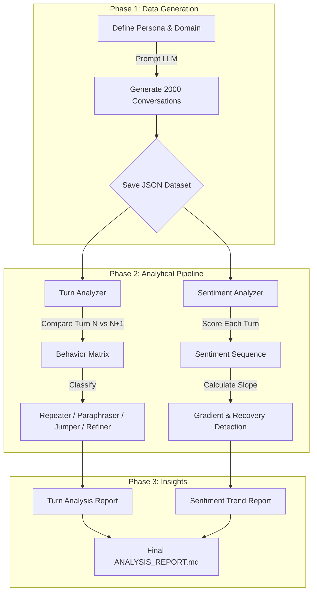

# Multi-Turn Dialogue & Sentiment Gradient Analysis

[](https://www.python.org/downloads/)
[](https://opensource.org/licenses/MIT)

A comprehensive framework for evaluating chatbot performance by analyzing **user behavior patterns** and **sentiment progression** across multi-turn conversations.

Unlike traditional evaluations that focus on one-shot accuracy, this project measures **how a conversation evolves**:
- Does the user get frustrated and repeat themselves?
- Does the sentiment improve or deteriorate over time?
- Does the user have to widely rephrase queries to get an answer?

---

## Examined Domains & Topics

This repository contains two parallel experiments comparing how users interact with chatbots in distinctive domains:

### 1. Mental Health & Wellness
*   **Target Model**: `nvidia/nemotron-3-nano-30b-a3b`
*   **Conversation Topics**: Anxiety management, sleep hygiene, work-life balance, stress reduction techniques.
*   **Characteristic**: High need for empathy, emotional validation, and continuous support.

### 2. Tax & Accounting
*   **Target Model**: `xiaomi/mimo-v2-flash:free`
*   **Conversation Topics**: Section 179 deductions, self-employment tax, IRS wash sale rules, GAAP revenue recognition.
*   **Characteristic**: High need for factual precision, regulatory citation, and specific constraints.

---

## Models Used

The pipeline utilizes a suite of specialized models for different stages of analysis:

| Stage | Task | Model / Algorithm | Purpose |
|-------|------|-------------------|---------|
| **1. Generation** | Data Synthesis | **OpenRouter API** (Nemotron / Mimo) | Generate realistic, multi-turn user-AI dialogues based on domain personas. |
| **2. Behavior** | Semantic Similarity | **BAAI/bge-reranker-v2-m3** | Determine if the user is asking the *same* question conceptually. |
| **2. Behavior** | Literal Similarity | **Levenshtein Distance** | Determine if the user is using the *same* words. |
| **3. Sentiment** | Emotion Tracking | **Twitter-RoBERTa-Latest** | 3-Class (Neg/Neu/Pos) sentiment scoring optimized for social/conversational text. |

---

## Architecture & Flow

The analysis pipeline follows a linear flow for each experiment:



---

## Analytical Methods

### 1. User Behavior Matrix
We classify the transition between User Turn $N$ and User Turn $N+1$ into four quadrants:

| Quadrant | Label | Signal | Definition |
|---|---|---|---|
| **I** | **Repeater** | **Friction** | High semantic + High literal match. The user is repeating the question, likely ignored. |
| **II** | **Paraphraser** | **Struggle** | High semantic + Low literal match. User is rewording the same intent, trying to be understood. |
| **III** | **Jumper** | **Flow** | Low semantic + Low literal match. Natural topic shift after a resolved query. |
| **IV** | **Refiner** | **Precision** | Low semantic + High literal match. Slight adjustment to logical constraints (e.g., "for 2024"). |

### 2. Sentiment Gradient
We track the **emotional trajectory** of a session:
*   **Trend Slope**: Is the conversation getting better ($>0$) or worse ($<0$)?
*   **Recovery Rate**: If a user expresses frustration (negative turn), do they end the session positively?

### 3. Validation (LLM Judge)
We validate the sentiment analyzer's performance by sampling random conversations (approx 15 sessions / 75+ turns) and comparing its scores against an **LLM Ground Truth** (Instruct Model).

| Domain | Accuracy | MAE | Insight |
|---|---|---|---|
| **Tax Support** | **86.9%** | **0.13** | High agreement. Model correctly identifies technical queries as neutral. |
| **Mental Health** | **27.6%** | **N/A** | **CRITICAL FAILURE**. Standard sentiment models conflate "User Distress" (Venting) with "User Dissatisfaction" (Hating the Bot). |

---

## Project Structure

```bash
├── .env                             # API keys & configuration
├── README.md                        # Project documentation
├── PROJECT_DOCUMENTATION.md         # Deep dive into math & methodology
│
└── experiments/
    ├── nvidia-nemotron-nano-30b/    # EXPERIMENT A: Mental Health
    │   ├── mental_health_conversations.json
    │   ├── ANALYSIS_REPORT.md       # Results: 76% Sentiment Improvement
    │   └── [Analysis Scripts]
    │
    └── xiaomi-mimo-v2-flash/        # EXPERIMENT B: Tax Support
        ├── dummy_conversations.json
        ├── ANALYSIS_REPORT.md       # Results: 44% Sentiment Worsening
        └── [Analysis Scripts]
```

---

## Quick Start

### 1. Installation
```bash
git clone https://github.com/dataelvisliang/chatbot-turn-behavior-analysis.git
pip install requests python-dotenv python-Levenshtein sentence-transformers transformers torch numpy
```

### 2. Run an Experiment
To reproduce the Tax Support analysis:

```bash
cd experiments/xiaomi-mimo-v2-flash

# 1. Generate Data (Optional, data already included)
# python generate_conversations.py

# 2. Run Analysis
python turn_analyzer.py
python sentiment_analyzer.py

# 3. View Report
# Open ANALYSIS_REPORT.md
```

---

## License
MIT License
