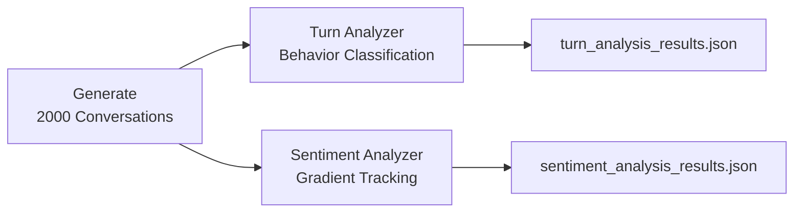

# Multi-Turn Dialogue & Sentiment Gradient Analysis

[](https://www.python.org/downloads/)
[](https://opensource.org/licenses/MIT)

Analyze **user behavior patterns** and **sentiment progression** in multi-turn chatbot conversations for the tax & accounting domain.

---

## Project Overview

This project provides a complete pipeline for:

1. **Generating** realistic multi-turn Q&A conversations (2000 conversations)
2. **Classifying** user behavior patterns between consecutive turns (Repeater, Paraphraser, Jumper, Refiner)
3. **Tracking** sentiment progression with gradient analysis and session-level features

### Use Cases

- Chatbot performance evaluation
- User frustration detection
- Conversation flow pattern analysis
- Sentiment trend monitoring

---

## Quick Start

### Installation

```bash
# Clone the repository
git clone https://github.com/dataelvisliang/chatbot-turn-behavior-analysis.git
cd chatbot-turn-behavior-analysis

# Install dependencies
pip install requests python-dotenv python-Levenshtein sentence-transformers transformers torch numpy
```

### Configuration

Create a `.env` file for data generation:

```env
OPENROUTER_API_KEY=your_key_here
OPENROUTER_MODEL=xiaomi/mimo-v2-flash:free
NUM_CONVERSATIONS=2000
```

### Run the Pipeline

```bash
# Step 1: Generate conversation data
python generate_conversations.py

# Step 2: Analyze turn-by-turn behavior
python turn_analyzer.py

# Step 3: Analyze sentiment gradients
python sentiment_analyzer.py
```

---

## Pipeline Architecture



---

## Task 2: Turn Behavior Analysis

Classifies user behavior between consecutive turns using:

| Model | Purpose | Output |
|-------|---------|--------|
| **Levenshtein Distance** | Literal/surface text similarity | 0.0 - 1.0 |
| **BGE Reranker v2 M3** (~568M params) | Semantic relevance | Raw logit score |

### Behavior Quadrants

|  | **High Literal** | **Low Literal** |
|---|---|---|
| **High Semantic** | **Repeater** | **Paraphraser** |
| **Low Semantic** | **Refiner** | **Jumper** |

### Sample Results (2000 conversations)

```
Quadrant I  (Repeater):    1278 ( 32.0%)
Quadrant II (Paraphraser):  721 ( 18.0%)
Quadrant III (Jumper):     1273 ( 31.8%)
Quadrant IV (Refiner):      726 ( 18.2%)
```

---

## Task 3: Sentiment Gradient Analysis

Tracks sentiment progression using:

| Model | Task | Parameters |
|-------|------|------------|
| **DistilBERT (SST-2)** | Binary sentiment | ~66M |

### Key Features Extracted

- **Trend slope** - Overall conversation direction
- **Sentiment gradient** - Turn-by-turn changes
- **Max drop/rise** - Frustration/satisfaction spikes  
- **Recovery detection** - Whether sentiment improves after drops
- **Lowest point turn** - Most frustrated moment

### Sample Results (2000 conversations)

```
OVERALL TRENDS:
Improving (slope > 0):   163 (  8.2%)
Stable:                 1729 ( 86.5%)
Worsening (slope < 0):   108 (  5.4%)
With recovery:             2 (  0.1%)
```

### Classification Thresholds

| Category | Condition | Description |
|----------|-----------|-------------|
| **Improving** | `trend_slope > 0.01` | Sentiment trending upward |
| **Stable** | `-0.01 <= slope <= 0.01` | Minimal change (dead zone) |
| **Worsening** | `trend_slope < -0.01` | Sentiment trending downward |
| **With Recovery** | `+1` gradient after `-1` | Positive turn after a drop |

---

## Project Structure

```
├── .env                             # API configuration
├── README.md                        # This file
├── PROJECT_DOCUMENTATION.md         # Detailed technical documentation
├── project_requirements.md          # Original requirements
│
├── generate_conversations.py        # Task 1: Data generation
├── turn_analyzer.py                 # Task 2: Behavior classification
├── sentiment_analyzer.py            # Task 3: Sentiment analysis
│
├── dummy_conversations.json         # Generated conversations (2000)
├── turn_analysis_results.json       # Behavior analysis output
└── sentiment_analysis_results.json  # Sentiment analysis output
```

---

## Documentation

For complete technical details including:
- Step-by-step process explanations
- Model architecture details
- Mathematical formulas
- Mermaid flow diagrams
- Worked examples

See: **[PROJECT_DOCUMENTATION.md](./PROJECT_DOCUMENTATION.md)**

---

## Dependencies

| Package | Purpose |
|---------|---------|
| `requests` | API calls to OpenRouter |
| `python-dotenv` | Environment variable loading |
| `python-Levenshtein` | Fast edit distance computation |
| `sentence-transformers` | BGE Reranker model |
| `transformers` | DistilBERT sentiment model |
| `torch` | GPU acceleration (CUDA) |
| `numpy` | Numerical operations |

---

## Performance

| Task | GPU Time | CPU Time |
|------|----------|----------|
| Data Generation | 30-60 min | 30-60 min |
| Turn Analysis | 5-10 min | 30+ min |
| Sentiment Analysis | 10-15 min | 45+ min |

*GPU: CUDA-compatible, 4-8GB VRAM recommended*

---

## License

MIT License - Feel free to use and modify for your research.

---

## Acknowledgments

- [Hugging Face Transformers](https://huggingface.co/transformers/)
- [BAAI BGE Reranker](https://huggingface.co/BAAI/bge-reranker-v2-m3)
- [Stanford Sentiment Treebank](https://nlp.stanford.edu/sentiment/)
